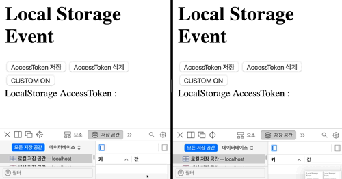

# 사용법

```typescript
import {
  init,
  addEventListener,
  removeEventListener,
} from "custom-local-storage";

// localStorage.setItem, localStorage.removeItem 사용하기 전에 실행
init("CustomStorage");

// 이벤트 리스너 등록, 삭제
addEventListener("CustomStorage", handleStorageChange);
removeEventListener("CustomStorage", handleStorageChange);
```

# Original Local Storage Event

- Browser의 Local Storage에 저장한 데이터가 변경 될 때 이벤트가 발생한다.
- 해당 이벤트의 경우 동일 Window에서 발생한 경우 감지하지 못하고 오로지, 다른 Window에서 발생할 때에만 감지할 수 있다.
- 애초에 용도가 서로 다른 Window 간의 데이터 공유를 위해서 만들어졌다고 한다.

```typescript
window.addEventListener("storage", eventHandler);
```

# Custom Local Storage Event

- 제작 의도에 맞지 않게, 동일한 Window에서 이벤트를 감지하고 싶은 경우, localStorage에서 제공하는 함수를 Customizing 해야 된다.
- 임시의 이벤트를 발생시켜 해당 이벤트를 가지고 처리하는 방식이다.
- setItem, removeItem을 실행하기 전 아래 코드를 먼저 실행하면 된다.

## CustomStorageEvent

```typescript
export class CustomLocalStorageEvent extends Event {
  key: string;
  oldValue: string;
  newValue: string;

  constructor(params: {
    type: string;
    eventInitDict?: EventInit;
    key: string;
    oldValue: string;
    newValue: string;
  }) {
    super(params.type, params.eventInitDict);
    this.key = params.key;
    this.oldValue = params.oldValue;
    this.newValue = params.newValue;
  }
}
```

## localStorage.setItem

```typescript
const originalSetItem = localStorage.setItem;

localStorage.setItem = function (key, value): void {
  const event = new CustomLocalStorageEvent({
    type,
    key,
    oldValue: localStorage.getItem(key),
    newValue: value,
  });

  window.dispatchEvent(event);

  originalSetItem.apply(this, [key, value]);
};
```

## localStorage.removeItem

```typescript
const originalRemoveItem = localStorage.removeItem;

localStorage.removeItem = function (key): void {
  const event = new CustomLocalStorageEvent({
    type,
    key,
    oldValue: localStorage.getItem(key),
    newValue: "",
  });

  window.dispatchEvent(event);

  originalRemoveItem.apply(this, [key]);
};
```

# 예제 실행

```bash
yarn && yarn build
cd example && yarn && yarn start
```

# 동작 확인 방법

## Original Local Storage Event

- 브라우저 2개를 띄워서 각각 http://localhost:3000/ 에 접속한다.
- AccessToken 저장, 삭제 버튼을 누르면서 현재 창이 아닌 다른 쪽 창의 상태를 확인한다.
- 현재 창은 변화가 없으며, 다른 쪽 창만 변화가 있다.


## Custom Local Storage Event

- CUSTOM ON 버튼을 누른다.
- AccessToken 저장, 삭제 버튼을 누르면서 현재 창과 다른 쪽 창의 상태를 확인한다.
- 현재 창, 다른 쪽 창 모두 변화가 있다.


